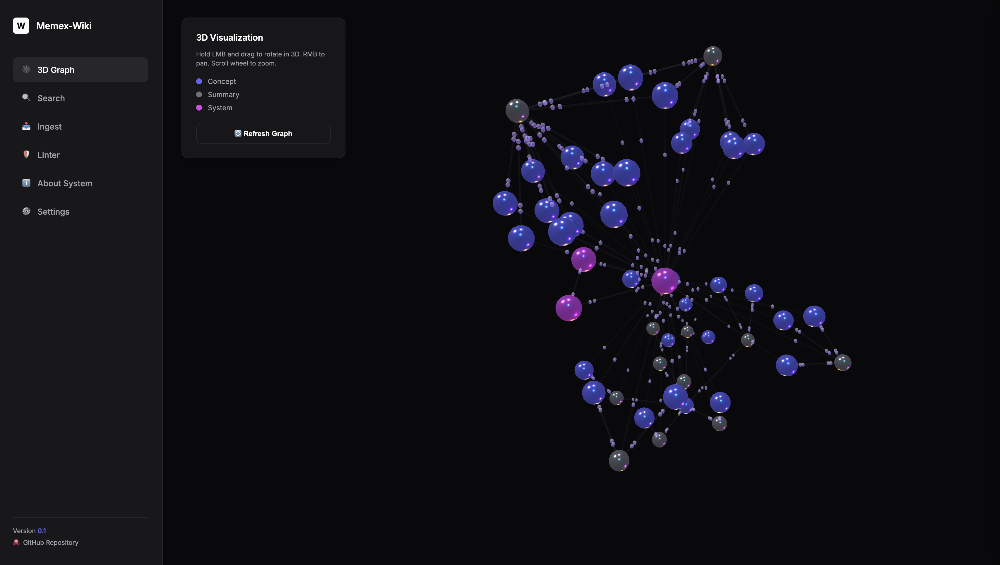
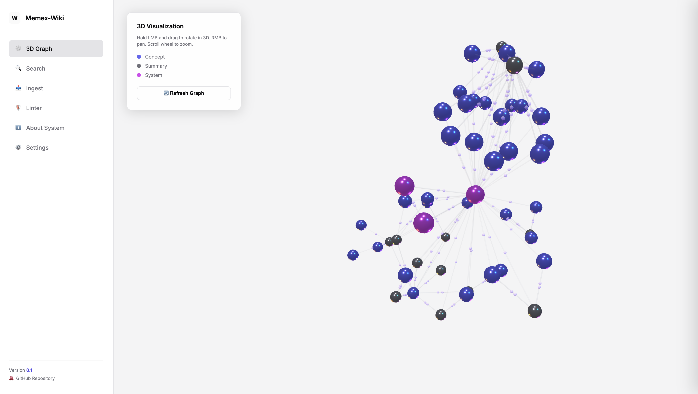

# Memex-Wiki: Local Hybrid Memory & Knowledge Graph for AI Agents (v0.1)

[English](#english) | [Русский](#русский)

---

# English

Memex-Wiki is a secure, offline-first, and resilient long-term memory system designed for AI agents (specifically integrated with Google Antigravity 2.0 and MCP clients). It compiles project documents and codebase knowledge into a human-readable Obsidian Markdown vault, automatically building a 3D visual knowledge graph (Concept links). 

For queries, it uses the **RLM (Recursive Long-context Memory) Engine** to sequentially filter text chunks, avoiding context overload, VRAM OOM, and CPU overheating on local hardware.

## Visual Interface

| Dark Theme | Light Theme |
| :---: | :---: |
|  |  |

## Architecture & Data Flow

1. **Raw Sources (Read-Only)**: The system monitors your project folders (scripts, markdown, readmes).
2. **AI Atomization (Ingest)**: A local LLM (via Ollama) or Gemini API analyzes files, compresses facts, and creates concept pages in Obsidian.
3. **Obsidian Graph**: Links act as graph edges. You can visually explore connections in 3D.
4. **RLM Search**: The AI reads only relevant graph nodes, ensuring accurate responses without hallucinations.

---

## Installation & Setup

### Prerequisites
* **Python 3.10+** (macOS, Windows, Linux)
* **Git** installed and configured
* **Ollama** (optional, for fully local execution)

---

### 🍏 macOS Setup
1. **Clone & Open**:
   ```bash
   git clone https://github.com/your-username/Memex-Wiki.git
   cd Memex-Wiki
   ```
2. **Install Dependencies**:
   ```bash
   chmod +x setup_env.sh
   ./setup_env.sh
   ```
3. **Configure**:
   ```bash
   cp config.example.yaml config.yaml
   # Open config.yaml and edit paths
   ```
4. **Run Server**:
   ```bash
   source .venv/bin/activate
   python3 src/web_server.py
   ```
   Open `http://localhost:8000` in your browser.

---

### 🪟 Windows Setup
1. **Clone & Open**:
   Use Git Bash or Command Prompt:
   ```cmd
   git clone https://github.com/your-username/Memex-Wiki.git
   cd Memex-Wiki
   ```
2. **Create Virtual Environment**:
   ```cmd
   python -m venv .venv
   call .venv\Scripts\activate
   pip install -r requirements.txt
   ```
3. **Configure**:
   ```cmd
   copy config.example.yaml config.yaml
   :: Open config.yaml in Notepad and adjust paths (use forward slashes, e.g., C:/Users/name/Obsidian/Vault)
   ```
4. **Run Server**:
   ```cmd
   python src/web_server.py
   ```
   Open `http://localhost:8000` in your browser.

---

### 🐧 Linux Setup
1. **Clone & Open**:
   ```bash
   git clone https://github.com/your-username/Memex-Wiki.git
   cd Memex-Wiki
   ```
2. **Install Dependencies**:
   ```bash
   python3 -m venv .venv
   source .venv/bin/activate
   pip install -r requirements.txt
   ```
3. **Configure**:
   ```bash
   cp config.example.yaml config.yaml
   # Open config.yaml and configure paths
   ```
4. **Run Server**:
   ```bash
   python3 src/web_server.py
   ```
   Open `http://localhost:8000` in your browser.

---

## Safety & Security Guidelines 🛡️

Memex-Wiki is designed with privacy in mind. Before hosting or pushing changes to public GitHub repositories, make sure:
1. **Local Paths & API Keys**: Always add `config.yaml` to `.gitignore`. Distribute configurations using `config.example.yaml`.
2. **Secret Redaction**: The backend (`src/security_filter.py`) automatically strips:
   * Google API Keys / Gemini Tokens
   * OpenAI API keys
   * Database connection strings (Postgres, Mongo, Redis, etc.)
   * Passwords and private keys from the ingested project files.
3. **No External Tracking**: When running on local Ollama, no data is sent outside your machine.

---

## Integration with Google Antigravity (MCP)

To hook up this memory system to your AI agents, add the following stdio server configuration:
* **Command**: `/path/to/Memex-Wiki/.venv/bin/python` (or `python.exe` on Windows)
* **Arguments**: `/path/to/Memex-Wiki/src/mcp_server.py`

### Exposed Tools
* `ingest_source(filename)`: Scan, atomize, and commit a project file.
* `query_memory(query)`: RLM-powered query across the compiled graph.
* `lint_memory()`: Health audit of wiki connections and metadata.

---

# Русский

**Memex-Wiki** — это безопасная, автономная и приватная система долгосрочной памяти для ИИ-агентов (в частности, для интеграции с Google Antigravity 2.0 и MCP-клиентами). Система аккумулирует знания в виде человекочитаемого графа связей (Markdown-файлов с YAML-метаданными) в вашем Obsidian Vault и автоматически строит 3D-визуализацию графа (связи концептов).

Для поиска используется движок **RLM (Recursive Long-context Memory)**, который осуществляет последовательную фильтрацию текстовых чанков, исключая перегрузку контекста, перегрев процессора и нехватку видеопамяти (VRAM OOM).

## Интерфейс панели управления

| Темная тема | Светлая тема |
| :---: | :---: |
|  |  |

## Архитектура системы и потоки данных

1. **Исходные файлы (Raw Sources)**: Папка с кодом, заметками и файлами ваших проектов (доступна только на чтение).
2. **ИИ-Атомизация (Импорт)**: Локальная модель Ollama или облачный Gemini API анализируют файлы и создают карточки концептов в Obsidian.
3. **Граф связей (Obsidian)**: Связи выступают дорожной картой. Вы можете вращать и исследовать 3D-граф в реальном времени.
4. **RLM-Поиск**: При запросе ИИ читает только связанные узлы графа, генерируя точные ответы без галлюцинаций.

---

## Настройка и установка

### Системные требования
* **Python 3.10+** (macOS, Windows, Linux)
* **Git** установленный и настроенный в системе
* **Ollama** (опционально, для 100% локальной работы)

---

### 🍏 Инструкция для macOS
1. **Клонирование**:
   ```bash
   git clone https://github.com/your-username/Memex-Wiki.git
   cd Memex-Wiki
   ```
2. **Установка зависимостей**:
   ```bash
   chmod +x setup_env.sh
   ./setup_env.sh
   ```
3. **Настройка**:
   ```bash
   cp config.example.yaml config.yaml
   # Откройте config.yaml и настройте пути к вашим папкам
   ```
4. **Запуск**:
   ```bash
   source .venv/bin/activate
   python3 src/web_server.py
   ```
   Откройте `http://localhost:8000` в браузере.

---

### 🪟 Инструкция для Windows
1. **Клонирование**:
   Откройте Git Bash или командную строку (Cmd):
   ```cmd
   git clone https://github.com/your-username/Memex-Wiki.git
   cd Memex-Wiki
   ```
2. **Создание виртуального окружения**:
   ```cmd
   python -m venv .venv
   call .venv\Scripts\activate
   pip install -r requirements.txt
   ```
3. **Настройка**:
   ```cmd
   copy config.example.yaml config.yaml
   :: Откройте config.yaml в Блокноте и укажите пути. Используйте прямые слэши (например: C:/Users/name/Obsidian/Vault)
   ```
4. **Запуск**:
   ```cmd
   python src/web_server.py
   ```
   Откройте `http://localhost:8000` в браузере.

---

### 🐧 Инструкция для Linux
1. **Клонирование**:
   ```bash
   git clone https://github.com/your-username/Memex-Wiki.git
   cd Memex-Wiki
   ```
2. **Создание окружения**:
   ```bash
   python3 -m venv .venv
   source .venv/bin/activate
   pip install -r requirements.txt
   ```
3. **Настройка**:
   ```bash
   cp config.example.yaml config.yaml
   # Отредактируйте config.yaml, указав пути
   ```
4. **Запуск**:
   ```bash
   python3 src/web_server.py
   ```
   Откройте `http://localhost:8000` в браузере.

---

## Безопасность и конфиденциальность 🛡️

Memex-Wiki спроектирован с упором на приватность:
1. **Локальные пути и ключи**: Файл `config.yaml` автоматически добавлен в `.gitignore`, чтобы ваши личные пути и ключи API не попали в публичный доступ на GitHub. Пользуйтесь шаблоном `config.example.yaml`.
2. **Очистка данных (Redaction)**: Встроенный модуль безопасности `src/security_filter.py` автоматически вырезает из загружаемых текстов:
   * Google / Gemini API ключи
   * OpenAI API ключи
   * Строки подключения баз данных (PostgreSQL, MongoDB, MySQL, Redis)
   * Пароли, приватные ключи и токены авторизации.
3. **Локальность**: При использовании бэкенда Ollama все операции ИИ происходят строго локально на вашем компьютере.

---

## Подключение к Google Antigravity через MCP

Для интеграции памяти с ИИ-агентами пропишите в настройках MCP-клиента:
* **Команда запуска**: `/path/to/Memex-Wiki/.venv/bin/python` (или `python.exe` на Windows)
* **Аргументы**: `/path/to/Memex-Wiki/src/mcp_server.py`

### Доступные инструменты (Tools)
* `ingest_source(filename)`: Импортировать файл проекта, провести атомизацию и закоммитить в Git.
* `query_memory(query)`: Выполнить точечный семантический RLM-поиск по графу Obsidian.
* `lint_memory()`: Провести аудит целостности связей и YAML-метаданных.
