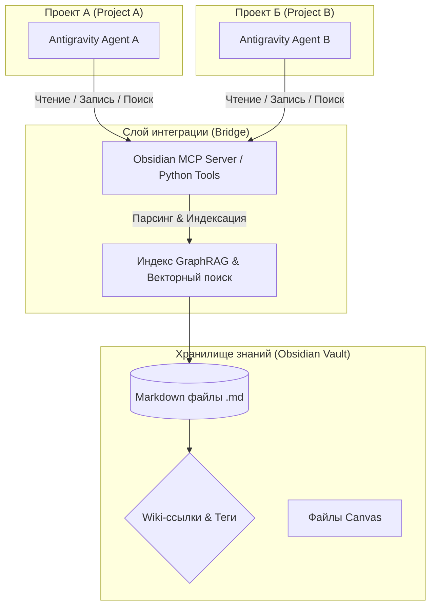

# Архитектурный анализ: Интеграция базы знаний Obsidian и графа связей с Google Antigravity 2.0

Этот отчет содержит анализ и описание наиболее эффективных и передовых архитектурных решений на **24 июня 2026 года** для подключения Obsidian (локальной базы знаний Markdown) и её графа связей к интеллектуальным агентам на базе **Google Antigravity 2.0 (AGY SDK)**. 

Основная цель — создать **единый разделяемый контекст (Shared Long-Term Memory)**, который позволит разным агентам, работающим в разных проектах, использовать общую память, обмениваться знаниями и сохранять контекст взаимодействия.

---

## 1. Архитектурная концепция: Единая разделяемая память (Shared Memory)

Для того чтобы агенты Antigravity могли работать в «одном контексте» между различными проектами, Obsidian выступает в роли **децентрализованной, человекочитаемой базы знаний (Human-in-the-Loop Knowledge Graph)**. 

### Схема взаимодействия


### Преимущества такого подхода:
1. **Human-in-the-Loop:** Человек видит структуру мыслей агентов в реальном времени через интерфейс Obsidian (граф, заметки, канвас) и может редактировать их вручную.
2. **Кросс-проектность:** Заметки, созданные Агентом А в проекте А (например, архитектурное решение), мгновенно становятся доступны Агенту Б в проекте Б.
3. **Граф связей (Graph):** Использование двунаправленных wiki-ссылок (`[[Имя заметки]]`) позволяет агентам выполнять многошаговый логический вывод (multi-hop reasoning), переходя по связям от одной темы к другой.

---

## 2. Три передовых сценария реализации (Июнь 2026)

### Вариант А. Интеграция через Obsidian Local REST API + MCP (Самый надежный и интерактивный)
Этот подход использует установленный в Obsidian плагин Local REST API, который открывает защищенный HTTPS-сервер для управления хранилищем.

* **Как это работает:**
  1. В Obsidian включается плагин **Local REST API**.
  2. Настраивается MCP-сервер (например, адаптированный под Antigravity `mcp-obsidian`), который общается с API плагина.
  3. В `LocalAgentConfig` для Antigravity прописывается подключение к MCP-серверу (через Stdio или SSE).
* **Плюсы:**
  - Изменения мгновенно отображаются в запущенном приложении Obsidian.
  - Поддерживается поиск, чтение фронтматера (frontmatter), работа с тегами и ссылками через официальное API.
* **Минусы:**
  - Требует, чтобы приложение Obsidian было запущено локально (или работал фоновый демон плагина).

### Вариант Б. Прямой файловый парсинг + FastMCP (Автономный и быстрый)
Агенты Antigravity работают напрямую с директорией Markdown-файлов. Мы пишем кастомный python-инструмент (или легковесный MCP-сервер на FastMCP), встроенный в SDK.

* **Как это работает:**
  - Python-скрипт парсит файлы в директории Obsidian.
  - Граф связей строится на лету с помощью библиотеки `networkx` путем парсинга регулярными выражениями `[[wikilinks]]`.
  - Семантический поиск реализуется через Gemini Embeddings API с сохранением индексов в локальную векторную базу (например, ChromaDB или LanceDB).
* **Плюсы:**
  - Полная автономность. Не нужно запускать само приложение Obsidian (подходит для серверного использования, CI/CD).
  - Максимальная скорость работы.
  - Легко кастомизировать логику графа на Python.

### Вариант В. Продвинутый GraphRAG (LightRAG / LlamaIndex)
Наиболее мощное решение для интеллектуального анализа графа связей. Вместо простого поиска по ключевым словам или векторам, агент понимает семантические сущности и связи между ними.

* **Как это работает:**
  - Применяется фреймворк класса **LightRAG** или **LlamaIndex Knowledge Graph**, оптимизированный для Obsidian.
  - Система извлекает сущности (Entity) и связи (Relationship) из ваших заметок, строит граф знаний и связывает его с векторными эмбеддингами.
  - Агент получает инструменты вроде `global_search(query)` (поиск по всему графу концептов) и `local_search(query)` (поиск по конкретным узлам и их соседям).

---

## 3. Проектирование структуры разделяемой памяти (Vault Schema)

Чтобы агенты не превратили Obsidian в свалку, необходимо внедрить строгую структуру папок и шаблоны заметок (Frontmatter). Рекомендуется следующая структура:

```text
📁 Obsidian_Antigravity_Memory/
├── 📁 .agents/                 # Профили агентов, логи сессий и их "внутренний диалог"
│   ├── 📄 Code_Architect_Agent.md
│   └── 📄 QA_Agent.md
├── 📁 projects/                # Информация о проектах (Агенты читают её для получения контекста проекта)
│   ├── 📄 Project_Alpha.md
│   └── 📄 Project_Beta.md
├── 📁 decisions/               # Архитектурные решения (ADR), принятые агентами
│   └── 📄 ADR-001-Database-Migration.md
├── 📁 concepts/                # База знаний (глоссарий, библиотеки, API, стандарты кодирования)
│   └── 📄 Antigravity_SDK_Best_Practices.md
├── 📁 tasks/                   # Задачи и TODO-листы (синхронизируются с task.md проектов)
│   └── 📄 Backlog.md
└── 📄 _index.md                # Главный индексный файл (карта памяти/MOC)
```

### Пример шаблона заметки (с разметкой связей для GraphRAG):
```markdown
---
type: decision
project: [[Project_Alpha]]
author: [[Code_Architect_Agent]]
status: approved
tags: [database, migration, postgres]
date: 2026-06-24
---
# ADR-001: Переход на PostgreSQL

## Контекст
Проект использует [[Project_Alpha]], в котором возникла необходимость поддержки транзакций.

## Решение
Использовать PostgreSQL версии 16. Интеграцию выполнить через [[Antigravity_SDK_Best_Practices]].
```

---

## 4. Практическая реализация на Google Antigravity SDK

Ниже представлен пример того, как зарегистрировать кастомный инструмент для чтения графа связей Obsidian в Python с использованием `google-antigravity` SDK:

```python
import os
import re
import networkx as nx
from google.antigravity import Agent, LocalAgentConfig, types

class ObsidianGraphManager:
    def __init__(self, vault_path: str):
        self.vault_path = vault_path
        self.graph = nx.DiGraph()
        self.build_graph()

    def build_graph(self):
        # Сканируем Markdown файлы и строим граф связей
        for root, _, files in os.walk(self.vault_path):
            for file in files:
                if file.endswith('.md'):
                    note_name = file[:-3]
                    file_path = os.path.join(root, file)
                    self.graph.add_node(note_name, path=file_path)
                    
                    with open(file_path, 'r', encoding='utf-8') as f:
                        content = f.read()
                        # Находим все [[wikilinks]]
                        links = re.findall(r'\[\[(.*?)\]\]', content)
                        for link in links:
                            # Убираем алиасы, например [[NoteName|Alias]] -> NoteName
                            target = link.split('|')[0]
                            self.graph.add_edge(note_name, target)

    def get_related_notes(self, note_name: str, depth: int = 1) -> list:
        # Нахождение связанных заметок в графе
        if note_name not in self.graph:
            return []
        # Возвращаем соседей (входящие и исходящие связи)
        neighbors = list(self.graph.neighbors(note_name)) + list(self.graph.predecessors(note_name))
        return list(set(neighbors))

# Создаем менеджер графа
vault_dir = "/Users/sergej/Documents/AI_Нейросети/Antigravity/09_Obsidian_Graph_Antigravity"
graph_manager = ObsidianGraphManager(vault_dir)

# Регистрируем инструмент для агента Antigravity
@types.tool
def query_obsidian_graph(note_name: str) -> str:
    """Возвращает список заметок, связанных с указанной заметкой в графе связей Obsidian."""
    related = graph_manager.get_related_notes(note_name)
    if not related:
        return f"С заметкой '{note_name}' нет прямых связей."
    return f"Заметки, связанные с '{note_name}': " + ", ".join([f"[[{n}]]" for n in related])

# Конфигурация агента
config = LocalAgentConfig(
    tools=[query_obsidian_graph],
    # Дополнительно можно подключить стандартный Obsidian MCP сервер
)
```

---

## 5. Рекомендации по развертыванию единой памяти

Для создания максимально стабильной и удобной системы рекомендуется комбинированный подход:

1. **Базовый слой хранения:** Хранить Vault в локальной папке (например, в iCloud Drive, Syncthing или приватном Git-репозитории) для мгновенной синхронизации между вашими устройствами.
2. **Слой работы агентов:** 
   - Запустить локальный **Obsidian Local REST API** плагин для интерактивной работы, когда вы сидите за компьютером.
   - Разработать фоновый Python-микросервис на базе **FastMCP**, который предоставляет API к вашему хранилищу по протоколу MCP.
3. **Правила для агентов (AGENTS.md / CLAUDE.md):** 
   - Внедрить в системный промпт каждого агента строгое правило: *«При принятии ключевых решений или изучении новой библиотеки всегда проверяй наличие заметок в Obsidian через инструмент поиска и обновляй граф связей при завершении задачи»*.
